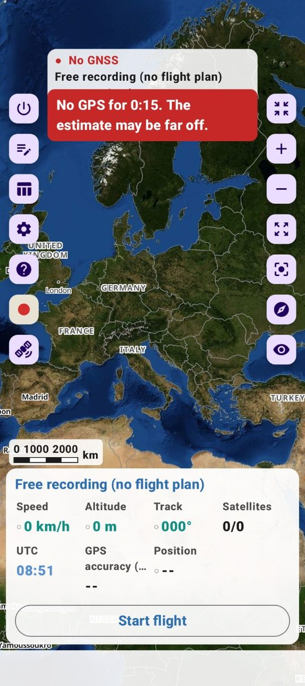
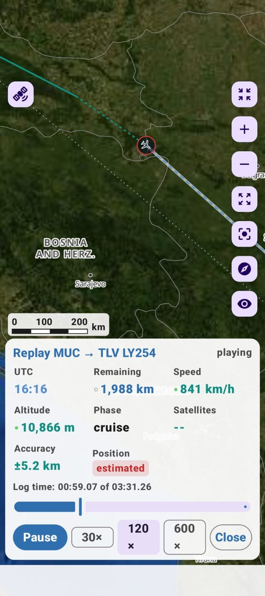
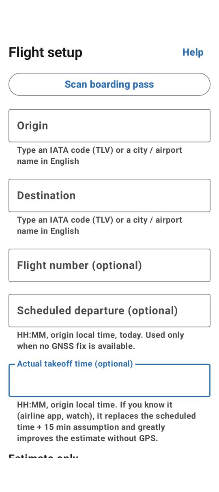
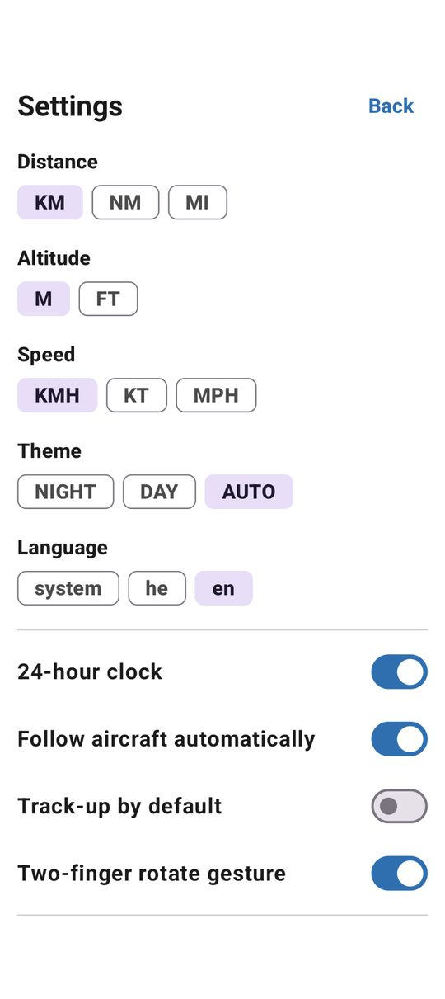
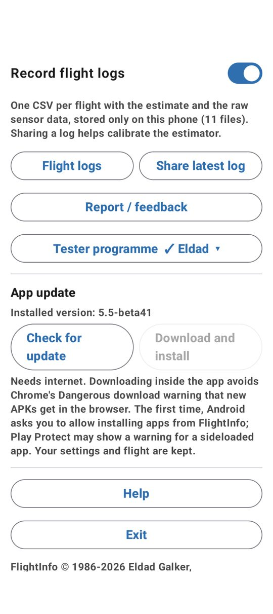
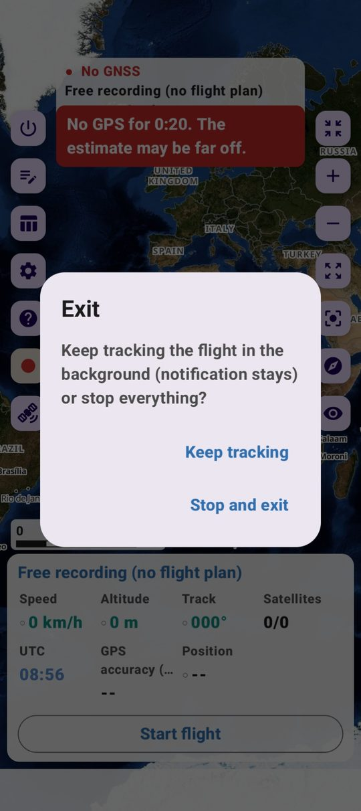
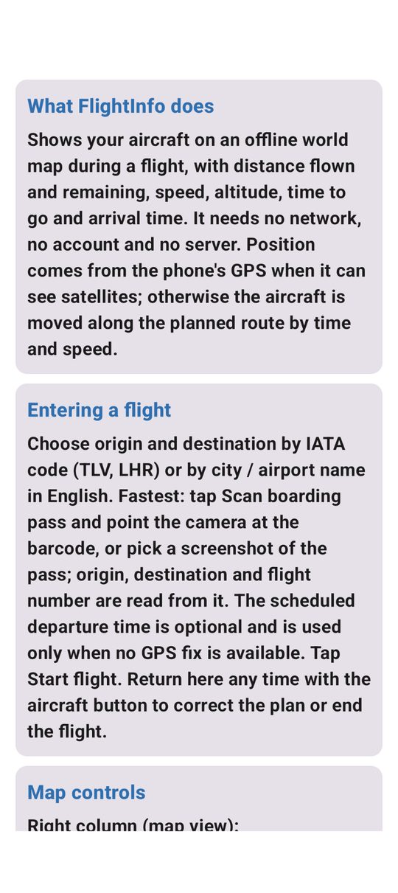

# FlightInfo — צילומי מסך

[English](SCREENSHOTS.md) · **עברית**

גרסה 5.5-beta41.

| | |
|---|---|
|  | **הקלטה חופשית (ללא תוכנית טיסה)** — כפתור REC מקליט חיישנים ויומן בלי מוצא או יעד. שורת המצב מראה על מה המיקום נשען; הפס האדום הוא אזהרת "אין GPS" המתגברת (30 ש׳ / 3 דק׳ / 10 דק׳) המבקשת להצמיד את הטלפון לחלון. סרגל קנה מידה עם שנתות מעל הלוח |
|  | **הילוך חוזר של טיסה מיומן (MUC → TLV)** — המסלול הנמדד טורקיז רציף, הקטע המוערך בפער GPS מקווקו, טבעת המטוס ותגית *Position* אדומות בזמן הערכה; *Accuracy* גדל עם המרחק שנטוס ללא תיקון. לוח אנגלי קבוע, 30/120/600× |
|  | **הגדרת טיסה** — סריקת כרטיס עלייה, או קוד IATA / שם עיר; יציאה מתוכננת והמראה בפועל (נמדדת בחיישנים כשהם מזהים אותה); מצב הערכה־בלבד לטיסה שאינך בה |
|  | **הגדרות** — יחידות מרחק / גובה / מהירות, ערכת נושא (AUTO ברירת מחדל), שפה (system ברירת מחדל), שעון 24, מעקב, כיוון־טיסה־למעלה, סיבוב בשתי אצבעות |
|  | **יומנים, משוב, תוכנית נסיינים, עדכון** — מנהל יומני טיסה (הילוך חוזר, בדוק/תקן, איחוד באישור, שיתוף, ייבוא), דיווח במייל או ב־GitHub, תוכנית נסיינים בהסכמה, עדכון מ־GitHub Releases בתוך האפליקציה |
|  | **יציאה** — להמשיך לעקוב / להקליט ברקע (ההתרעה נשארת), או לעצור הכול: שירות, מנוע ותהליך |
|  | **עזרה** — כל הסעיפים בתוך האפליקציה, אנגלית או עברית, עם הגרסה ותאריך השחרור בכותרת |

