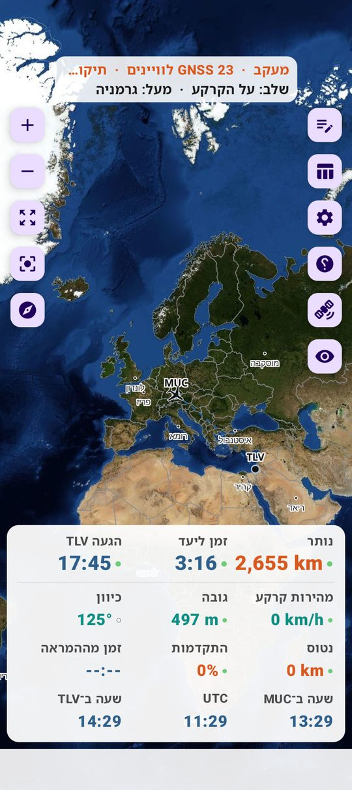
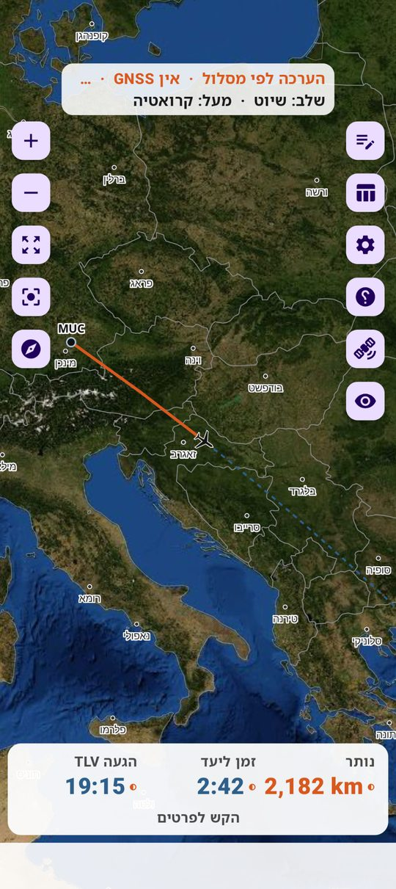
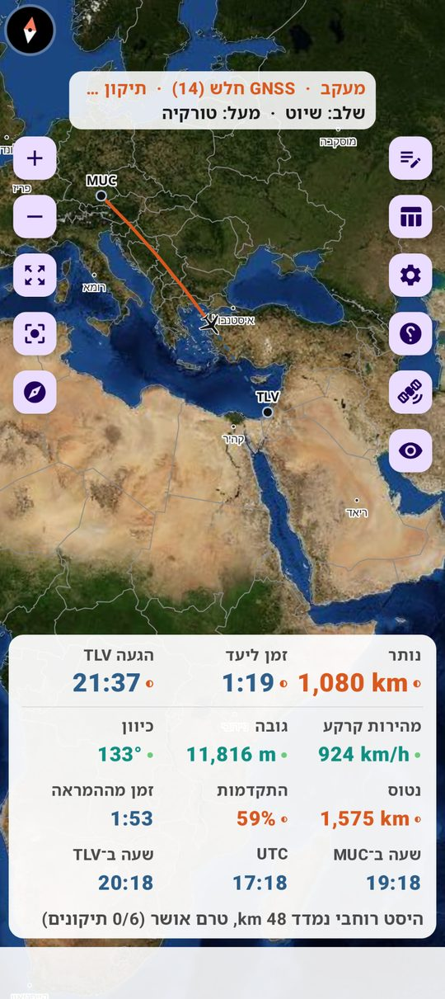
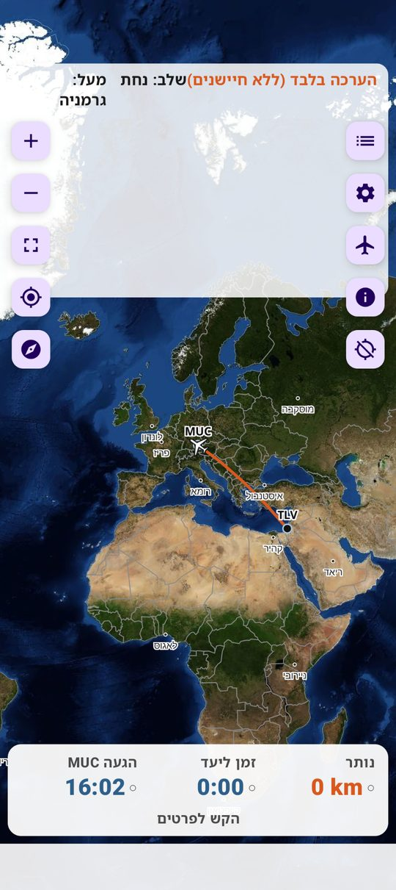
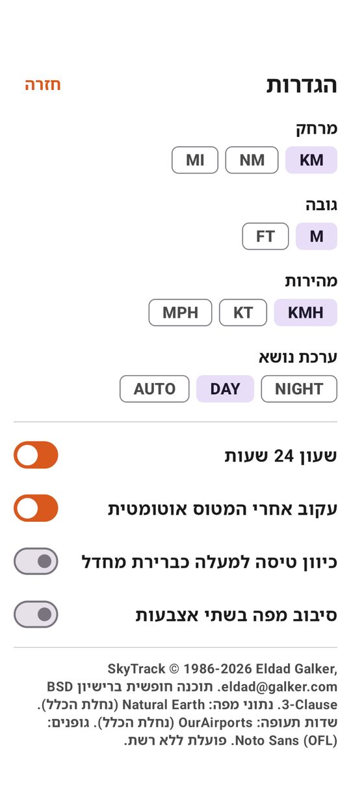

# FlightInfo — צילומי מסך

| | |
|---|---|
|  | **בשער במינכן** — תצלום אוויר Blue Marble, המסלול המתוכנן ל־TLV, לוח נתונים פתוח: מרחק, זמן ליעד (כולל ההמתנה להמראה), שעות במוצא/UTC/יעד |
|  | **שיוט מעל קרואטיה** — קטע שעבר (כתום), המשך מתוכנן (מקווקו), שורת מצב עם שלב ומדינה |
|  | **מעל טורקיה, לוח מלא** — צילום מהטיסה שחשפה את כשל v2 (המטוס מצויר על התוכנית במקום במיקומו) והוביל ל־v4 |
|  | **מצב הערכה** — מעקב אחר טיסה שאינך בה, לפי שעת יציאה |
|  | **הגדרות** — יחידות, ערכת נושא, שפה, רשת, תצלום אוויר, יומנים, עדכון |

הצילומים מגרסאות בטא 2.x–4.x; פרטים בממשק משתנים בין גרסאות.

